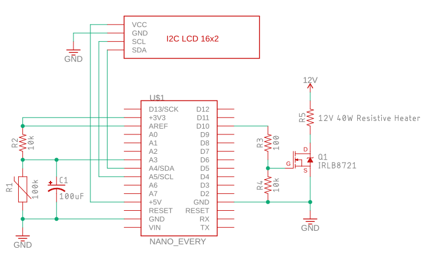

# Arduino-PID-heater
PID temperature control of a resistive heater using arduino.

### Table of Contents
1. [Getting Started](#getting-started)
  - [Requirements](#requirements)
  - [Setup & Installation](#setup-&-installation)
    - [Thermistor Calibration](#thermistor-calibration)
2. [Usage](#usage)
  - [Commands](#commands)
3. [Materials](#materials)
4. [Wiring Scheme](#wiring-scheme)

## Getting Started
### Requirements
The following arduino libraries are used:
- Arduino PID Library by Brett Beauregard (br3ttb)
- Ticker by Stefan Staub
- DFRobot_RGBLCD library if you are using DFRobot's 16x2 I2C RGB LCD
  - It is similar to the LiquidCrystal_I2C library so if you use a different LCD you may only need to make minor changes
  
### Setup & Installation
Make relevant modifications and upload the sketch to your arduino.

Here's what you may need to modify based on your specific application:
- pin assignments
- R_SERIES value (see Thermistor setup below)
- NUM_COEFF and thermistorCoeffs values (see Thermistor setup below)
- minTemp and maxTemp values 
- samplingInterval and numSamplesToAvg, The first is how often the temperature is measured and the second is how many are averaged to produce a more reliable reading
- computePIDInterval, how often to update the PID loop, should be >= samplingInterval * numSamplesToAvg
- updateLCDInterval, how often you want the LCD screen to display the temperature
- Kp, Ki, Kd gain values, when the program starts it loads these values from EEPROM at address 0, 4, and 8, respectively
  - A separate set of values is also coded in as defaults for reference and backup
  - The first time you run the program you may need to write some initial gain values to the EEPROM
- if instead of using a single logic level MOSFET you use a NPN transistor to control a standard MOSFET then you will need to invert the PID
  - I don't recommend this since a connection issue or loss of logic supply would lead to uncontrolled heating

#### Thermistor Calibration
There are two scenarios:
1. You have the thermistor table that relates temperature to its resistance
2. You don't know the thermistor's temperature and resistance characteristics

If you have the table there should be plenty of data points for you to use. I recommend fitting 1/T vs ln(R) to a 4th order polynomial or greater. 
This is better than the Steinhart-Hart equation. The empirical function typically deviates from the thermistor table by <0.01 C (from 25C to 100C) and <0.03C from (25C to 200C) in my case.
Store the polynomial coefficients and number of them in (thermistorCoeffs and NUM_COEFF). If you use a 4th order polynomial then you will have 5 coefficients.

If you do not have the table you will need to setup the typical thermistor voltage divider circuit with a series resistor and record the readings at known temperatures.
You can make many measurements and fit to a polynomial like above, or you can use the Steinhart-Hart equation and solve for the 3 coefficients with 3 measurements (e.g. ice water 0C, boiling water 100C, room temperature ~25C).
The Steinhart-Hart equation is the same as the 4th order polynomial except with the 3rd and 5th coefficients set to 0, so you don't need to modify the code.

For the series resistor in the final device you should choose a resistance that is the same as the thermistor's resistance at the temperature you will be most likely be working at.
For example, the Semitec 104NT-4-R025H42G is a 100k thermistor and so it is 100 kOhm at 25 C. But since I plan to have the heater around 80 C most of the time, the resistance will be 10.8 kOhm, so I would use a 10 kOhm series resistor

## Usage
The arduino parses its serial buffer for commands. If the command is valid it then executes it. 
To send commands you will need to connect the arduino to a usb port and use a program like Arduino Serial Monitor or PuTTY to send commands.
Each command must have a header and foot character to indicate the beginning and end of your message. By default these are ">" and "\n", respectively, but can be changed.
For a list of commands see below. The arduino can also report relevant info like temperature, setpoint, MOSFET PWM, etc. which can be immediately plotted by arduino's serial monitor for live data display (This is useful for tuning your gains manually, will add more on this later).

Instead of sending manual commands like above, you can automate the device or use as part of a larger program. This can be done for example with PySerial.
A Python module for controlling this specific arduino heater and using it in combination with other devices for lab automation is available here:
[add link]

If you want to develop your own software package then the communication protocol is as follows:
Host sends a command to the arduino:
If the command is valid, the arduino responds "ACK" + and optional message
If the command is invalid, the arduino responds "NAK  + and optional message
Then the arduino proceeds to execute the command.
If the action was performed successfully, the arduino responds with "SUCC"  + and optional message
If the action encountered a problem, the arduino responds with "FAIL"  + and optional message.

The arduino response characters can be changed in the sketch to any char(s) or byte(s) you want, such as "\x06" for ACK.

### Commands

To add all commands and descriptions here

## Materials
Current design uses a 12V cartridge heater which is now very common and inexpensive due to the rise of FDM 3D printers.
It also uses a 100k thermistor commonly used in 3D printers as well (Semitec 104NT-4-R025H42G). You can change these as long as you have appropriately rated components.

Here are the materials you will need. The specific components I used are indicated in parenthesis.
- Arduino microcontroller
- 16x2 LCD screen (if you don't care about displaying to an lcd screen you can remove the update LCD function/timer and its setup code)
- Thermistor (Semitec 104NT-4-R025H42G potted into a cartridge, very common as 3D printer hot end supplies)
- Resistor in series with thermistor (10kOhm for my case)
- Decoupling capacitor (clean up ADC reading from thermistor circuit, I used 100 uF but it can be smaller)
- Resistive heater (12V 40W cartridge heater designed for 3D printer hot ends)
- Logic level MOSFET (IRLB8721)
- Gate resistor (100 Ohm, some people swear by it and some people say it is totally unnecessary)
- Gate pull down resistor (10kOhm)
- Power supply for the heater (12V5A AC/DC wall adapter for my 40W heater)
- Appropriate gauge wire for heater circuit (e.g. 18 AWG for 12V 40W -> 3.3A for safety)
  - If you are using a breadboard or proto/perf/stripboard with thin traces then put a wire in parallel with the traces to handle the current

Keep grounds common between the heater and thermistor circuits but keep them apart otherwise the pwm output will induce oscillations in your thermistor ADC readings.

## Wiring Scheme

